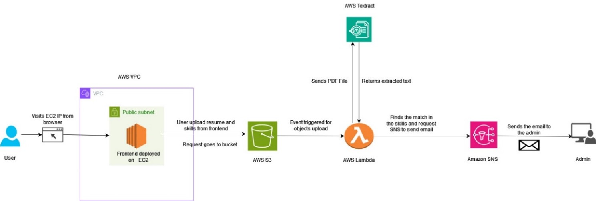

# Serverless Resume Analyzer App

The Serverless Resume Analyzer App is a cloud-native application designed to automate resume analysis using AWS services. By leveraging serverless architecture, the app can efficiently handle large numbers of resume submissions and provide quick feedback, making it an ideal solution for recruitment platforms.

# Features

**Resume Parsing:** Automatically extracts key information such as name, contact details, skills, and work experience from resumes.

**Skill Matching:** Compares resume contents with predefined skill sets.

**Automated Feedback:** Sends feedback and analysis results to admins via email.

**Serverless Architecture:** Scalable and cost-effective, fully built on AWS.

# Technology Stack

**AWS Lambda**: Serverless compute to handle resume processing.

**Amazon S3:** Storage for uploaded resumes.

**AWS Textract:** Extracts text from uploaded resumes (PDF/DOCX).

**Amazon SNS:** Notifies the admin via email with the analysis results.

**Amazon EC2:** Hosts the frontend for user interaction.

**Python:** Backend programming for Lambda functions and processing logic.

# Architecture Overview

Below is the architecture diagram illustrating the flow of the application:

# Flow:

**User:** Uploads a resume and selects required skills through the frontend, hosted on Amazon EC2.

**Amazon S3**: The resume and skill data are uploaded and stored in an S3 bucket.

**AWS Lambda**: A Lambda function is triggered by the S3 upload, which processes the resume and sends the file to AWS Textract for text extraction.

**AWS Textract**: Extracts text from the resume and returns it to the Lambda function.

**AWS Lambda**: The extracted text is analyzed to check for skill matches. If a match is found, the Lambda function triggers an alert via Amazon SNS.

**Amazon SNS**: Sends an email with the analysis and feedback to the admin.

# Setup

To get the Serverless Resume Analyzer App up and running, follow the steps below for setting up the infrastructure using AWS CloudFormation. This will provision all the necessary AWS resources, including S3, Lambda, Textract, SNS, and EC2.

## Step 1: Provision AWS resources

Create a stack using AWS Cloudformation using the  Cloudformation.yaml file.

## Step 2: Uploading from the Web App

Upload the resume in the Web Application and then add the necessary skills.

## Step 3: Results

The results will be sent in an email to the admin.

